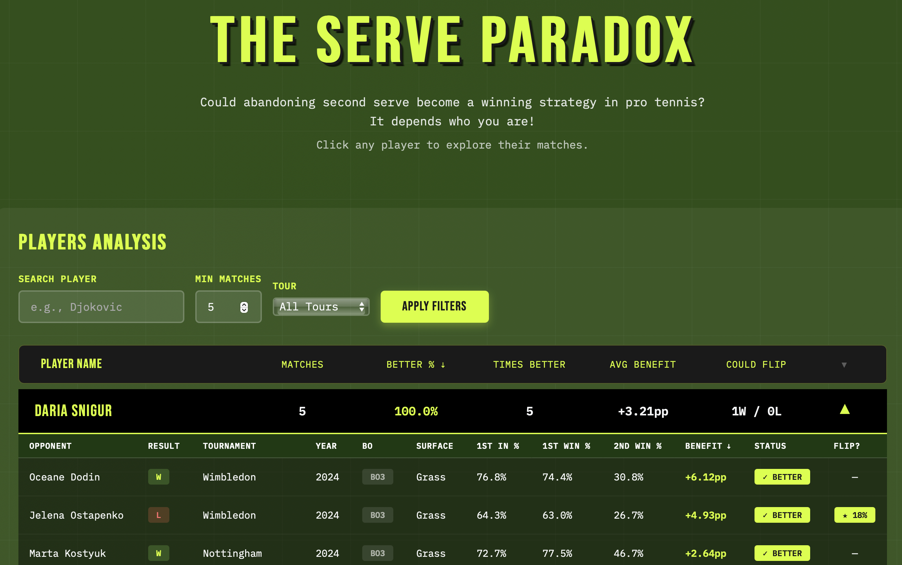

# The Serve Paradox

**Live Site:** https://tennis-analyzer-eight.vercel.app

An interactive analysis of ATP and WTA tennis matches exploring when players might benefit from abandoning their second serve entirely.



## The Theory

In professional tennis, players typically get two chances to serve:
1. **First serve**: Usually faster, more aggressive
2. **Second serve**: Safer, more defensive (to avoid double fault)

But what if the statistics suggest a player would win more points by hitting **only first serves** (accepting double faults) rather than using a second serve?

## The Math

**Traditional serving strategy:**
- Point win % = (1st_in% × 1st_win%) + ((1 - 1st_in%) × 2nd_win%)

**Only first serves strategy:**
- Point win % = (1st_in% × 1st_win%) + ((1 - 1st_in%) × 1st_in% × 1st_win%)

**The condition:** A player benefits from "only first serves" when:
```
1st_in% × 1st_win% > 2nd_win%
```

### Example: Carlos Alcaraz (US Open 2024 QF)
- 1st serve in: 72%
- Win % on 1st serve: 89%
- Win % on 2nd serve: 41%

**Only first serves:**
- 0.72 × 0.89 + 0.28 × 0.72 × 0.89 = **82.0%**

**Traditional:**
- 0.72 × 0.89 + 0.28 × 0.41 = **75.6%**

**Result:** Alcaraz would gain **+6.4 percentage points** by only hitting first serves!

## Features

- **Player-level analysis**: Click any player to see their individual match breakdowns
- **ATP & WTA data**: Toggle between tours or view combined
- **Sortable columns**: Sort by matches played, benefit rate, avg benefit, etc.
- **Monte Carlo simulation**: Matches flagged where the strategy could flip the match outcome
- **Match details**: Expandable view showing opponent, tournament, surface, and all serve stats

## Tech Stack

- **Analysis**: Python (pandas, numpy)
- **Frontend**: Vanilla HTML/CSS/JavaScript
- **Deployment**: Vercel
- **Data**: CSV processing with Monte Carlo simulation

## Data

- **Source**: Jeff Sackmann's tennis databases
  - ATP: https://github.com/JeffSackmann/tennis_atp
  - WTA: https://github.com/JeffSackmann/tennis_wta
- **Coverage**: 2024 season (updates available as new data is published)
- **License**: Creative Commons Attribution-NonCommercial-ShareAlike 4.0

## Files

- `tennis_player_view-embedded.html` - Main site with embedded match data
- `update_data.py` - Script to pull latest ATP/WTA data, run analysis, and deploy
- `data.json` - Extracted match data (also embedded in HTML)

## Updating Data

To pull the latest match data and redeploy:

```bash
python update_data.py
```

This will:
1. Download current ATP and WTA match data from GitHub
2. Calculate serve statistics and run Monte Carlo simulations
3. Update the embedded data in the HTML
4. Deploy to Vercel

## Key Insights

### Why This Happens
Players where this phenomenon occurs typically have:
1. **Strong first serve** (high % in, high % won)
2. **Weak second serve** (low win %)
3. The first serve is SO good that even with double faults, it outperforms the second serve

### Strategic Implications
While the math is clear, players don't actually do this because:
- Psychology: Double faults are demoralizing
- Opponent adaptation: They'd move in on every serve
- Risk aversion: Traditional strategy feels safer
- Context matters: Score, momentum, pressure situations

But it's fascinating to see when the pure statistics suggest otherwise!

## License & Attribution

This analysis uses data from:
- **Jeff Sackmann / Tennis Abstract**
- Licensed under Creative Commons Attribution-NonCommercial-ShareAlike 4.0

---

**Created:** December 2024
**Deployed:** Vercel
